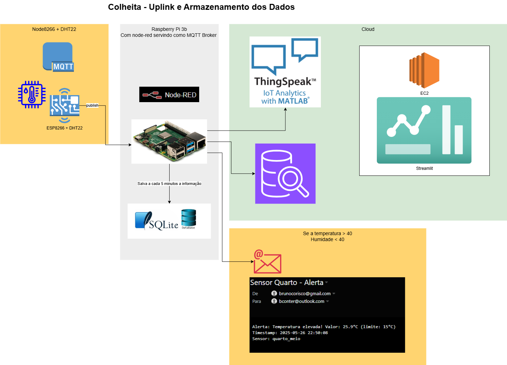

# 🚜 FarmTech Solutions – Fase 7 / Capítulo 1  
**FIAP - Faculdade de Informática e Administração Paulista**  
Projeto Integrador – Curso de Inteligência Artificial

<p align="center">
  <a href="https://www.fiap.com.br/">
    
  </a>
</p>

---

## 👨‍💻 Integrantes
- [Alex da Silva Lima (RM559784)](https://www.linkedin.com/in/a1exlima/)
- [Johnatan Sousa Macedo Loriano (RM559546)](https://www.linkedin.com/in/johnatanloriano/)
- [Matheus Augusto Rodrigues Maia (RM560683)](https://www.linkedin.com/in/matheus-maia-655bb1250/)
- [Bruno Henrique Nielsen Conter (RM560518)](https://www.linkedin.com/in/brunoconter/)
- [Fabio Santos Cardoso (RM560479)](https://www.linkedin.com/in/fabiosantoscardoso/)

## 👩‍🏫 Professores
- **Tutor:** [Leonardo Ruiz Orabona](https://www.linkedin.com/in/leonardoorabona/?originalSubdomain=br)  
- **Coordenador:** [André Godoi](https://www.linkedin.com/in/profandregodoi/)

---

## 📘 Descrição do Projeto

Este repositório contém os artefatos finais da **Fase 7** do curso de IA da FIAP. O projeto consolida os módulos das Fases 1 a 6 da startup fictícia **FarmTech Solutions**, voltada ao agronegócio inteligente.

**Funcionalidades Integradas:**
- Cálculo de área e manejo de insumos
- Banco de dados relacional
- IoT com ESP32
- Machine Learning
- Visão computacional com YOLO
- Infraestrutura AWS (SNS/SQS)
- Dashboard interativa com Streamlit

> Os serviços podem ser acessados via comandos no terminal ou por botões na interface gráfica.

---

## 📦 Entregáveis

### 🚩 Entrega 1: Dashboard Integrada
- Unifica os serviços das Fases 1, 2, 3 e 6
- 📂 Código principal: `script/streamlit.py`
- Fluxo no Node-Red: `script/flows.json`
- Codigo ESP8266: `script/esp8266.ino`
- 🎥 [Vídeo demonstrativo (YouTube)](https://youtu.be/bz00SSZfo8M)

---

### 📡 Entrega 2: Serviço de Mensageria (AWS SNS/SQS)
- Alertas via e-mail/SMS com base em:
  - Sensores IoT (Fases 1 e 3)
  - Visão computacional (Fase 6)
- 📂 Script dashboard: `script/streamlit.py`


---

## 🧱 Arquitetura do Sistema

<p align="center">
  
</p>

---

### ▶️ Passo a Passo

1. **Clone o repositório**
   ```bash
   git clone https://github.com/brunocorisco86/1TIAOR_FIAP_fase7_cap1.git
   cd 1TIAOR_FIAP_fase7_cap1
